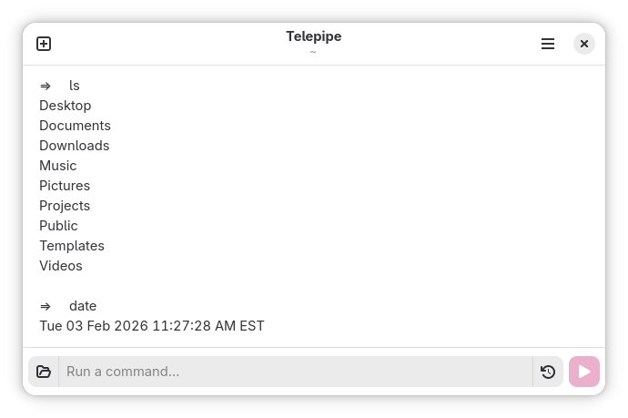

# Telepipe

Run command-line apps smoothly.

## Description

Telepipe is a graphical command-line shell for GNOME. It allows you to run command-line applications using modern text editing conventions, such as using the mouse to move your cursor when entering a command, or dragging-and-dropping text selections from the command output window back into the command entry or out to other programs.

Despite appearances, it is **not a terminal**. This means that TUI apps will not work in Telepipe, but most text-mode programs should work without issue. This also means that you should consider Telepipe itself to be your shell, instead of an interface to your shell.

Telepipe's name is a portmanteau of *teletypewriter* (or *teletype*), a device which in this context allows the user to run a command-line shell from a physical typewriter, and *pipe*, a common command-line feature on UNIX and UNIX-like systems which allows the output of one command to be used as the input of another commnand. Pipelines are an especially powerful way to leverage command-line applications for advanced text editing and formatting, and Telepipe provides advanced features for using shell pipelines which [interact with the clipboard](https://github.com/vtrlx/telepipe/blob/trunk/docs/Clipboard%20Redirection.md).

## Installing

As Telepipe is currently unreleased, it must be built and installed from source.

To build and install Telepipe, use [Flatpak Builder](https://docs.flatpak.org/en/latest/flatpak-builder.html). Clone this repository, navigate to it in a command-line shell, then run:

```sh
flatpak-builder build ca.vtrlx.Telepipe.json --user --install --force-clean
```

After installing, run Telepipe either from the app menu or using the command `flatpak run ca.vtrlx.Telepipe`.

If you've made changes to Telepipe, it's advised to test them by building and installing under the development application ID in order to preserve the unmodified Telepipe.

```sh
flatpak-builder build ca.vtrlx.Telepipe.Devel.json --user --install --force-clean
```

Test your changes with `flatpak run ca.vtrlx.Telepipe.Devel` or by selecting it from the app menu.

## Moving From a Terminal to Telepipe

Because it is not a terminal emulator, Telepipe omits many features you likely expect from one. Most expected keyboard shortcuts are absent. Command output is not colorized at all and only uses a proportional font.

By default, many command-line programs will work flawlessly in Telepipe. This is because most well-behaved command-line applications will detect that they are not running inside a terminal, and adjust their outputs accordingly.

Some commands will work in Telepipe, but in ways which are unintuitive. In these cases, workarounds are likely present. For instance, shells will default to running in non-interactive mode, but can be made interactive by passing a flag—usually `-i`. Shells forced to be interactive may emit error messages when started, but should otherwise work as expected.

Certain commands which depend explicitly on terminal support (like `vim`) fail to exit when executed in a non-terminal environment. These programs need to be stopped manually.

Advice on how to be use specific commands is detailed in the [Tips and Tricks document](https://github.com/vtrlx/telepipe/blob/trunk/docs/Tips%20and%20Tricks.md).

## Features

**Clipboard redirection**: Commands run in Telepipe can use the current clipboard contents as their input by prefixing with `>`, they can automatically copy their output to the clipboard by prefixing with `<`, or they can do both by prefixing with `|`.

More information—including examples—is available in this feature's [documentation page](https://github.com/vtrlx/telepipe/blob/trunk/docs/Clipboard%20Redirection.md).

**Output editing:** The command output section is a full text editor. This allows you to make notes, amend output for further execution, or quickly erase sections of command output which are no longer needed. Additionally, selections from the terminal output can be dragged-and-dropped down into the command entry. Because output from `ls` can be quickly dropped into further command lines, this greatly alleviates the need for tab completions (which Telepipe does not have).

**Obvious exit status:** Commands which exit with errors will have their exit status noted after their output has finished displaying, eliminating the need to include it in one's shell prompt (which Telepipe does not have).

**Interactive history:** Each of Telepipe's tabs keeps its own history, accessible from the up arrow button to the right of the command entry (visible only when there is a command history). From here, commands may be rerun, copied to the clipboard, or removed from history.

## Anti-Features

Telepipe is not intended to replace existing terminal emulators. There are many features common to those programs which are explicitly intended not to be included in Telepipe, such as:

- Tab completion
- Output colorizing
- Monospace text
- TUI support
	- Text editors such as `vim`, `emacs`, `nano`, etc
	- Pagers such as `more` or `less`
	- System monitors such as `top` or `htop`
- Most signals (signalling the end of input with Ctrl+D is still possible as many programs depend on it)
- A shell prompt (unless explicitly running an interactive shell)

## License

Telepipe is free software distributed under the terms of the GNU General Public License version 3 or later. See COPYING for more information.
